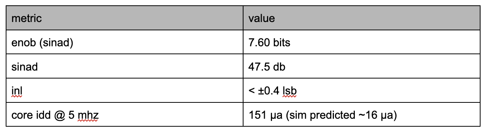

# two years at cornell custom silicon systems

the goal: build a battery-powered chip small enough to tag a wild bird, accurate enough to pick up its call.

---

## kestrel (fall 2024 – spring 2025)

kestrel was our first tapeout: an 8-bit fully differential sar adc in tsmc 180nm. sar adcs narrow in on a value one bit at a time, like twenty questions against an analog voltage — precise and power-efficient without needing much speed.

**signal flow:** vin+/vin− → sampling switches → cdac → comparator → fsm → 8-bit output

### silicon results

{: width="70%"}

the linearity numbers were solid. the current draw wasn't: measured idd was 10x simulation, traced to parasitic leakage and clock distribution power that never made it into the sim budget (the kind of lesson only silicon teaches you). best part: we digitized and reconstructed a real scrub jay call, and the spectrogram clearly showed its frequency-modulated chirps.

### key design choices

• **binary-weighted cdac (no split cap):** a split array saves area but adds parasitic capacitance that corrupts bits, not just gain. we couldn't calibrate around corrupted bits, so we kept the full array.
• **imcs switching:** roughly halves capacitor count and switching energy vs. a conventional sar — critical when your chip runs off a coin cell strapped to a bird.
• **bottom-plate sampling:** makes charge injection signal-independent; since kestrel is differential, it cancels as common mode.
• **double-tail comparator with kickback cancellation:** zero static power, with cancellation transistors sized at half the input pair width to cancel regeneration kickback.

---

## after kestrel (fall 2025 – spring 2026)

two parallel projects: one chasing speed, one chasing minimum power.

### project 1: adiabatic flash adc

flash adcs are the fastest topology — all comparators fire at once — but that speed normally costs continuous power. adiabatic (charge recovery) logic recovers switching energy into a resonant supply instead of dumping it as heat. as far as we could tell, a fully adiabatic flash adc hadn't really been attempted before.

**power budget:** ~80 µw total (3-bit) — roughly 30x lower than kestrel (not an apples-to-apples comparison, since kestrel is 8-bit).

• adiabatic comparator: 4.27 µw avg, ~2x better than kestrel's double-tail comparator.
• built a full scrl standard cell library from scratch. the scrl inverter runs 62x more efficient than cmos (1.85 fj vs. 115.77 fj); nand 33x; nor 15x.
• everything runs off a 4-phase trapezoidal power clock built around an lc tank — amplitude asymmetry under 0.002 mv, phase accuracy within 1%. sloppy clocks undo everything adiabatic gates buy back.
• reference generation: the "fully adiabatic" resonant capacitive divider suffered charge drift, so we used a boring 50 kω resistor divider instead. sometimes the boring answer wins.

**why scrl specifically:** of the adiabatic logic families (ecrl, pfal, cal, scrl), scrl stays structurally close to regular cmos, keeping the learning curve manageable, and needs a simpler power clock scheme overall.

### project 2: asynchronous sar adc

same 8-bit differential, imcs-based design as kestrel, but with the clock removed from the bit-decision loop. a synchronous sar waits for a clock edge whether or not the comparator has settled; an async sar triggers each stage the instant the prior one signals "done."

**three hard problems:**

- **pulse width sensitivity:** a level-triggered "go" signal broke down near 5 ns pulses. fixed by building a custom edge-triggered sr latch from scratch.
- **precharge coupling:** the comparator's reset window was implicitly set by logic propagation delay (~6 ns), which drifts with process corner. added a separate delay line to control precharge independently, stretching the window to ~23 ns and making it corner-independent.
- **simulation at scale:** at 68,000+ instances, we had to benchmark several sim strategies (plain spectre, spectre with parasitic optimization, spectre ms, mixed xcelium/spectre ams) just to find a flow that would finish before the next design review.
