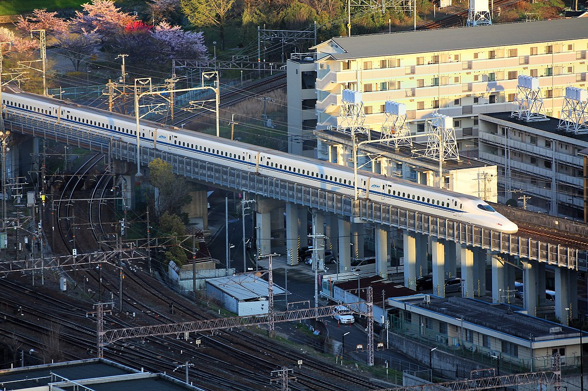
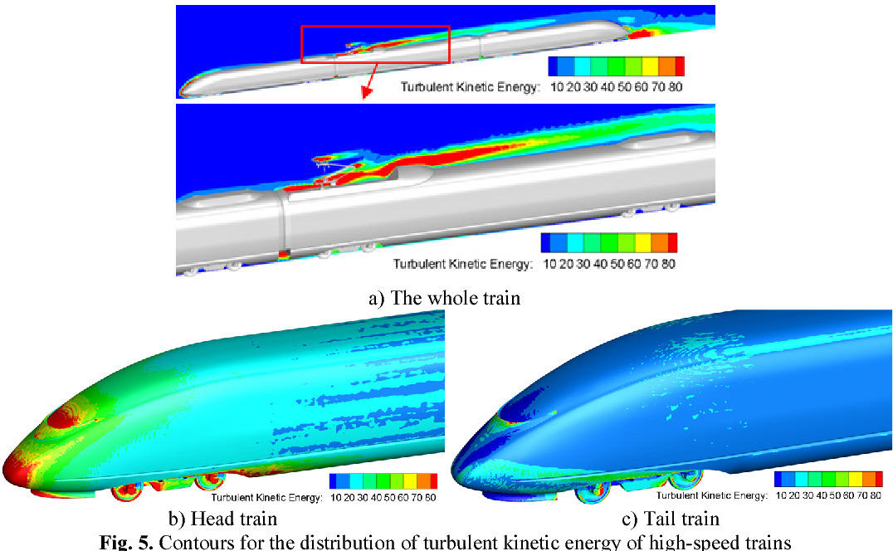
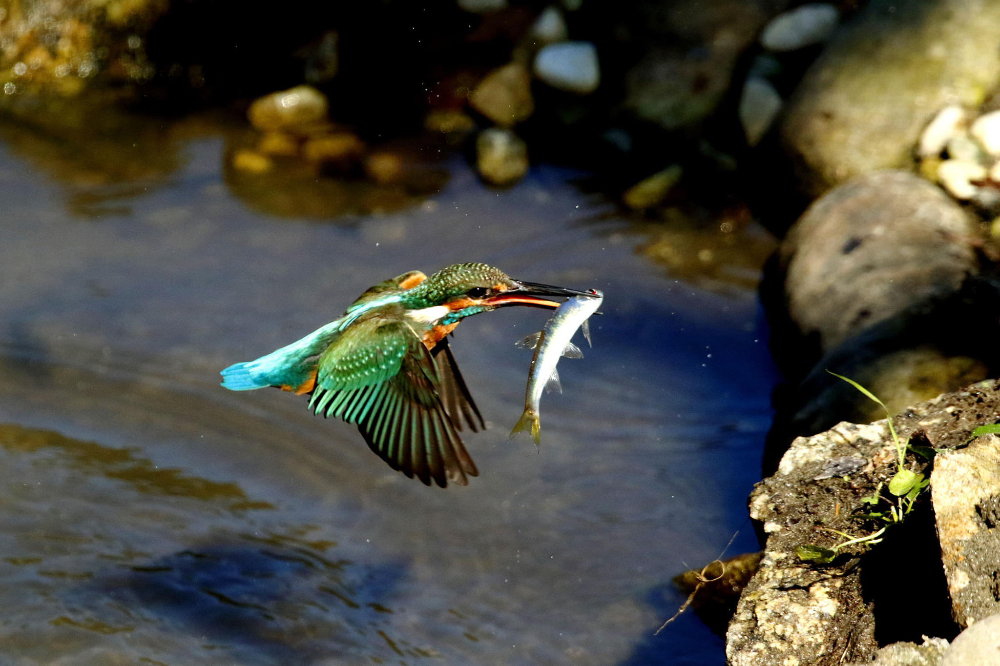
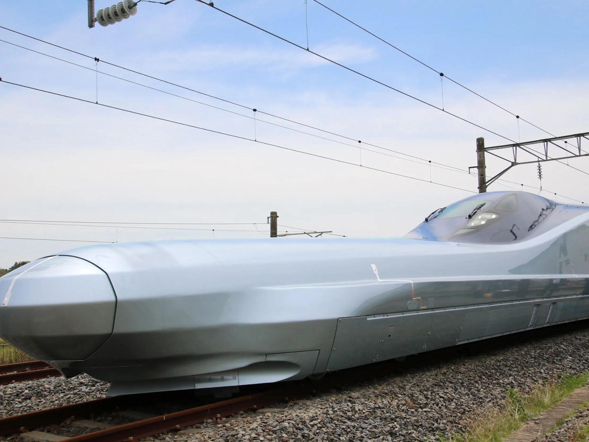
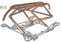
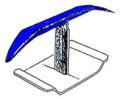

# birds on railways
biomimicry's application in high-speed rail transport

## dream super-express

trains are not just old-fashioned transportation. when considering modern urban planning theory, aiming for walkable communities, trains are seen as the future of transportation because of their efficiency, safety, and—with the japanese bullet train, or shinkansen—speed.

*photo by marek slusarczyk on 14 april 2021*

indeed, japan is revolutionizing public transportation with the shinkansen. it reduced travel time between japan's two biggest cities from 7 hours to 3, earning it the nickname "dream super-express." before its development, japan's regions were disconnected, but the shinkansen united the country.

the engineers faced a tough design process to create the shinkansen. the group was called the "crazy gang" by the japanese people who deemed the challenge impossible. the engineers needed to think of something extraordinary, turning to biomimicry and drawing inspiration from birds. biomimicry is design inspired by animals and nature. the word comes from "bios," meaning life, and "mimesis," meaning to mimic.

although trains do not fly like birds, the connection lies in the field of aerodynamics. aerodynamics, the study of airflow around solid objects, is pertinent to both trains and birds due to their ability to move rapidly.

*picture by w. lu, et al. on 31 march 2017*  
*visualized in computational fluid dynamics (cfd) assessing aerodynamic efficiency*

birds have evolved to have the most efficient body shape and wings for flying effortlessly through the air. this persuaded the engineering team behind the shinkansen to apply inspiration from several birds—from penguins to owls—to several components of the train, including the nose and the pantograph, the piece connecting to the train's power source by mounting onto the overhead wires.

interestingly, this idea originated from an engineer on the team who enjoyed bird-watching in his free time.

## the engineer & bird-watcher

in the utoni-ko sanctuary, kingfishers commonly visit every morning in march. eiji nakatsu—a member of japan's wild bird society—wakes up early in the morning, eager to see the bird.

he waited for the bird's *kik-kik-kik* sound, similar to the sound of a bicycle brake in need of oil. in minutes, he looks up as soon as he hears it, and behold, there it is, displaying its magnificence. bobbing its head, scanning the water. in an instant, he saw the bird zoom past the pond, with minimal splash, and pick up a fish along the way. after he blinked, it was gone.

*photo by canon bird branch project on 2020*

nakatsu was the general manager of the shinkansen's technical development department in 1997. after he witnessed the kingfisher, inspiration struck. exhilarated by the spotting, he got to his office with haste, drafting a plan for his colleagues for what would become one of the final designs for the train.

## what would nature do (wwnd)?

while the engineers were not trying to replicate the kingfisher's flight, they wanted to understand how it was able to fly above water at high speeds with hardly any splash from the water below.

the main problem with the shinkansen happened when it entered tunnels. the increase in pressure from the train caused a loud bang, known as a sonic boom. sonic booms occur when something moves faster than sound, creating a noise like thunder. while humans can experience sonic booms without injury, they could damage the train's structure.

the kingfisher inspired nakatsu's solution as it dealt with minimal air resistance when it transitioned from the low pressure of the air to the high pressure of the water, demonstrated by the lack of splashing when fish hunting. nakatsu thought of the water and air as fluids, a connection he'd capitalized on when considering their pressures in a high-speed environment. by using biology and observing the kingfisher's evolution, the engineers determined that the beak made it all possible.

this primarily affected the nose of the train. the beak of the kingfisher is precise, having a long and narrow shape. by incorporating a similar shape to the shinkansen's nose, it eliminated the sonic boom produced by the sudden increase in pressure.

it was able to allow the train to run at higher speeds and still adhere to the standard noise level of 70 decibels a (dba), equivalent to the sound of a washing machine, mandated by the japanese government to avoid noise pollution.

*photo by jiji press on 9 may 2019*

## beyond the kingfisher

"there's actually a lot more than just this kingfisher example that most people are familiar with," explains astrid layton, an assistant professor of mechanical engineering at texas a&m, "because the kingfisher was so successful, they started looking at other areas, too, and ended up also mimicking the wings of an owl, which also makes things quieter, and the belly of a penguin."

the owl was used because the shinkansen's nose wasn't able to suppress all sound or greatly reduce vibration. similarly to the kingfisher, the primary focus for this implementation was its face. the concave shape of the owl's face, resembling a crescent moon, effectively absorbs sound. furthermore, the engineers took inspiration from its body, which allowed for smooth flight, following an upward trajectory. these changes affected the train's pantograph, the piece allowing for the train to connect to the power source, which used to vibrate and produce loud noise.

in addition, the engineers found inspiration from the adelie penguin's body shape to improve the pantograph's supporting frame. the adelie penguin's spindle-like shape allowed it to effortlessly move while hunting fish. by applying this shape to the pantograph, the engineers were able to minimize its wind resistance, mirroring the adelie penguin's effortless transition from the high-pressure environment of water to the low-pressure conditions of the air.

| design | before | after |
|---|---|---|
| pantograph wing |  |  |
| pantograph base |  |  |

*photos by scott sheppard on 23 april 2012*

## a train spotter's dream

today, the shinkansen is more than just a symbol of japan's post-world war ii recovery and resurgence—it's a train enthusiast's dream.

i can still feel the excitement as i clutched my camera, eagerly awaiting the arrival of the train. despite the bustling crowd, i managed to secure a spot in a corner.

in a flash, it hissed past me at an unimaginable speed, leaving no time to capture a photo. but even without a tangible image, its magnificence was undeniable. i knew that its splendor would forever be etched in my memory.
